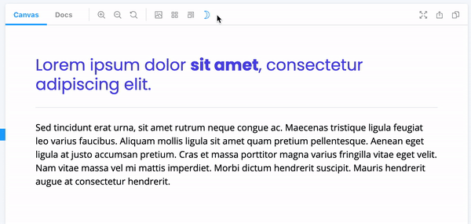

# storybook-tailwind-dark-mode



## Installation

Install the following npm module:

```sh
npm i --save-dev storybook-tailwind-dark-mode
```

or with yarn:

```sh
yarn add -D storybook-tailwind-dark-mode
```

Then, add following content to `.storybook/main.js`

```js
module.exports = {
  addons: ['storybook-tailwind-dark-mode']
};
```
